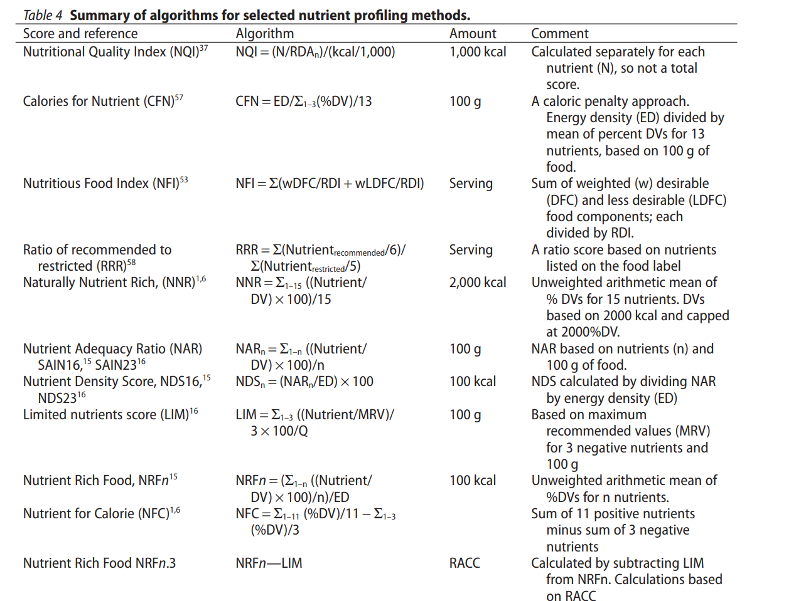
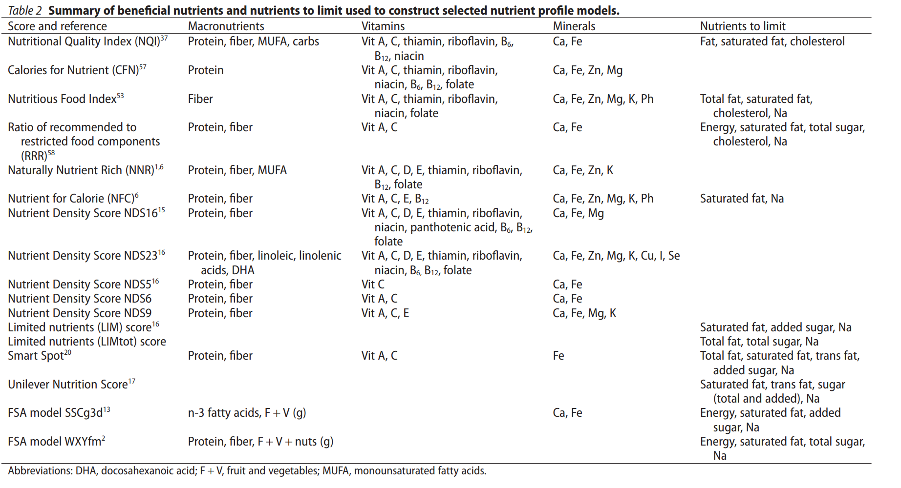
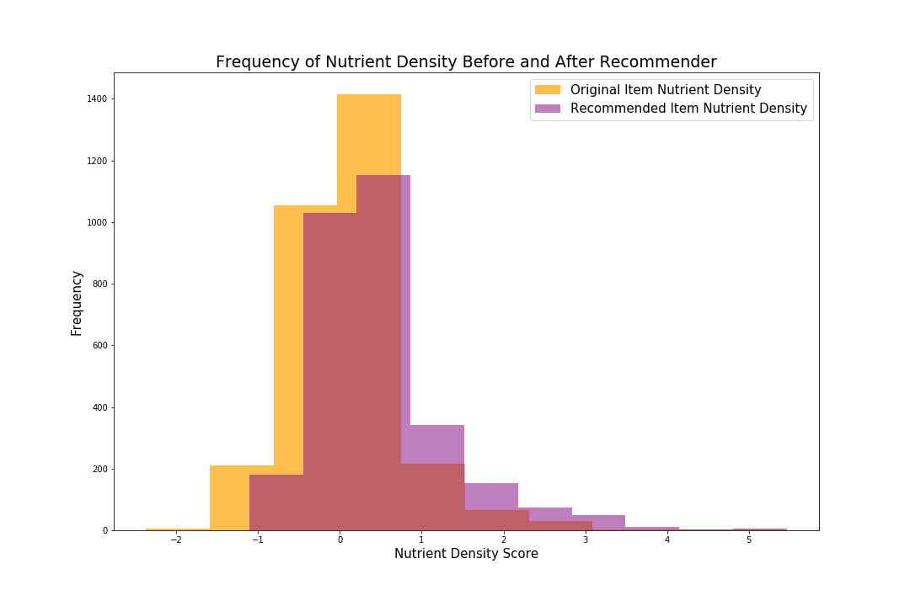
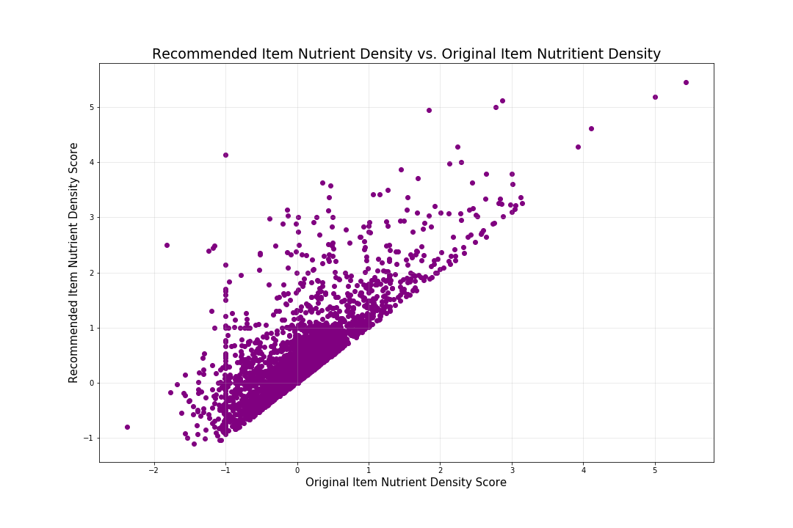

# Recommender System for Healthier Groceries
---------------------

## Problem Statement
---------------------
Create a recommender system that will take an input of a branded grocery item, and output a list of similar food items that are healthier.

## Defining "Healthier"
----------------------
The definition of healthy food has taken many forms over the years:
 - More nutrients, fewer calories
 - Bucketing certain food groups as healthy: fruits, veggies, lean meats, etc.
 - Bucketing certain foods as unhealthy: high fat including nuts, olives, coconuts and avocados due to fat phobia
 - Focus on Recommended Dietary Allowance - rigidity of this method disqualified a lot of foods
 - Reference amounts: Gradients of nutrient density - "good source of", "excellent source of" vs. "free", "low", "reduced", "less"
 - Tiers of foods

### Selecting Calculation to Use to Define Healthier
 There are several options to define "healthy" food (shown below).  For the purpose of this project, I am using the nutrient rich food index.  This is the unweighted arithmetic mean of %DV for n nutrients minus x negative nutrients.

 

### Selecting Nutrients to be Used in Calculation
Nutrient Rich Food NRFNn.3 (NRFNn - LIM) =
 - NRFNn = Nutrient Density Score NDS6: Protein, Fiber, Vitamin A, Vitamin C, Calcium, Iron, Monounsaturated Fats, Potassium, Magnesium
 - LIM = Limited Nutrients Score: Trans fats, Saturated Fats, Sugars, Sodium

 

## Data Cleaning
---------------------
In order for the recommender system to work, the data need to be tagged into categories of similar food items.  The FDC has categorized some of the food into categories, but many were not specific enough or null values.  This lead me to use unsupervised learning to tag the items.

The inputs to my unsupervised learning model were:
 - Food description
 - Food ingredients

The vectorizers tested were:
 - Count vectorizer: lower performance
 - TF IDF vectorizer: best performance
 - Word2vec: was way too slow to load on the large amount of data

The unsupervised learning models tested were:
 - KMeans Cluster: best performance
 - DBSCAN Cluster
 - Agglomerative Cluster

## Recommender
---------------------
My recommender system is not based on cosine similarity, so I could not use the standard recommender function.  I wrote code to make the recommender based on food category and nutrition score.  

The recommender takes a food keyword term as an input.  The output is a list of food items that match that keyword.  The user then selects a food item from the list.  Then the recommender outputs a dataframe of food items in the same food category that have a higher nutrient score.

## Results
---------------------
The recommender system was tested by sampling 3000 branded food items from the FDA's database and running them through the recommender.  Then an item was recommended with a higher nutrient density score.  The graphs below depict the original item's nutrient density score versus the recommended item.  Overall the items selected were in the same food category and had improved nutrition.  

## Future Work
---------------------
I am currently working on the following items:
1. Refining nutrient density calculation to allow for user to select nutrients of interest to increase and limit
2. Improving tagging of food items
3. Deploying recommender in flask webpage

## References
-----------------------
- Food Data Central - https://fdc.nal.usda.gov/download-datasets.html
- Nutrient Rich Food Index - https://onlinelibrary.wiley.com/doi/full/10.1111/j.1753-4887.2007.00003.x
- Scientific Report of the 2015 Dietary Guidelines Advisory Committee - https://health.gov/dietaryguidelines/2015-scientific-report/
- Instacart Kaggle Dataset - https://www.kaggle.com/c/instacart-market-basket-analysis/data
